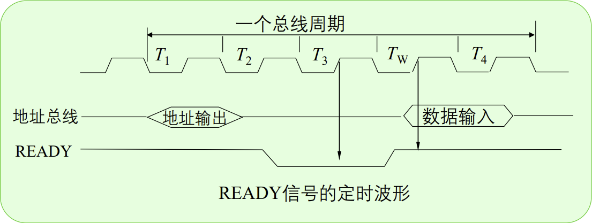

# 微机接口

*Author: Yang Bowen*

*Last modified: 2023/5/21*
# 8086 Microprocessor

1. 8086按功能分：
    - 总线接口部件BIU：CPU和存储器与IO读写
    - 执行部件EU：执行指令
2. 位数差异
   
   
    |  | 8086 | 8088 |
    | --- | --- | --- |
    | 位数 | 16 | 16 |
    | 内部数据通路 | 16 | 8 |
    | 外部数据通路 | 16 | 8 |
3. BIU
   
    段寄存器：CS DS ES SS
    
4. EU
   
    标志寄存器：
    
    - 状态标志 6位
    
    ```
    OF：overflow flag：溢出标志
    SF：sign flag：符号标志
    ZF：zero flag：全零标志
    PF：parity flag：奇偶校验标志（偶1为1）
    AF：auxiliary flag：辅助进位标志，小进位（最低4位向更高位进位）
    CF：carry flag：进位标志
    ```
    
    - 控制标志 3位
    
    ```
    DF：方向标志：串指令的地址向减小变化
    TF：跟踪标志：单步指令
    IF：中断允许表示：可屏蔽中断
    ```
    
5. 地址：
    - 实际地址 16位
    - 物理地址 20位
6. 四个时钟周期的区别
    - T1 Address High
    
    > 在T1期间CPU把存储器或外设的地址放到总线上，这些地址信息由ALE控制锁存到地址锁存器中，以便使总线上可以传送数据信息。
    > 
    - T2 Address Low
    
    > T2期间AD15~AD0上的地址已消失，在数据还未到达前，分时复用的地址/数据总线处于高阻态，以便为读入或写出数据作准备。
    > 
    - T3 R/W Status
    - Tw Wait
    
    
    
    - T4 Data
    
    > 在T3和T4期间，读或写的数据出现在总线上，以使完成读或写的操作。
    > 
    
    8086读周期时序
    
    
    
    8086写周期时序
    
    
    

## 外部引脚

- BHE： Bus High Enable
  
    该信号三态输出，低电平有效。用来表示数据总线上的数据是否有效。
    
- ALE：Address Latch Enable（OUT）
  
    地址锁存允许信号，向外部输出，高电平有效。当它为高电平时，表明CPU地址线上有有效地址。当它为低电平时，对地址进行锁存。
    
- DEN：Data Enable （OUT）
  
    当它为低电平时，表时数据线上有有效数据。在最小模式系统中用来用数据收发器8286/8287的选通信号。
    
- READY（IN）
  
    准备就绪信号，高电平有效。它是由被访问的内存或I/O设备发出的响应信号，当其有效时，表示存储器或I/O设备已准备好，CPU可以进行数据传送；无效时，CPU插入一个或几个等待周期TW，直到READY信号有效为止。
    
- RESET（IN）
  
    RESET信号至少保持4个时钟周期。CPU接收到该信号后，停止操作，并将标志寄存器，段寄存器，指令指针IP和指令队列等复位到初始状态。
    
- RD
  
    读信号，三态输出，低电平有效。
    表示当前CPU正在读存储器或I/O端口。
    
- WR
  
    写信号，三态输出，低电平有效。
    表示当前CPU正在写存储器或I/O端口。
    
- M/IO
  
    存储器或I/O端口访问信号，三态输出。
    
    高电平表示CPU正在访问存储器；低电平表示CPU正在访问I/O端口。
    

### 和DMA工作方式有关的引脚

主机和外围设备间的数据传送方式：

> 程序无条件传送
程序有条件传送
程序中断
DMA
- HOLD：Hold Request（IN）
  
    总线请求，高电平有效，通过此引脚总线的主控者向CPU请求使用总线。
    
- HLDA：Hold Acknowledge（OUT）
  
    总线响应，高电平有效，CPU一旦测试到HOLD请求时，就在当前总线周期结束时，使HLDA有效，表示响应这一总线请求，并立即让出总线使用权。
    

### 和中断有关的引脚

- INTR：Interrupt Request（IN）
  
    可屏蔽中断请求信号，高电平表示外部向CPU发出中断请求。CPU一旦测试到中断请求信号，并且IF=1时，暂停正在执行的操作转入中断响应周期。
    
- NMI：Non-Mackable Interrupt Request（IN）
  
    不可屏蔽中断请求信号，CPU一旦测试到NMI有效信号，当前指令执行完后就自动响应中断。
    
- INTA：Interrupt Acknowledge（OUT）
  
    低电平有效，表示CPU响应了外部发来的INTR信号。
    

# 74LS138


当G1高电平，G2A/ G2B低电平时，可将地址端（A、B、C）的二进制编码在一个对应的输出端以低电平译出。

> 74LS138的译码快速计算法：
CBA，A为低位，C为高位；
A、B、C输入是：111，对应4+2+1=7，Y7输出0；
A、B、C输入是：011， 对应4+2+0=6，Y6输出0；
A、B、C输入是：110，对应0+2+1=3，Y3输出0；
A、B、C输入是：101，对应4+0+1=5，Y5输出0。
